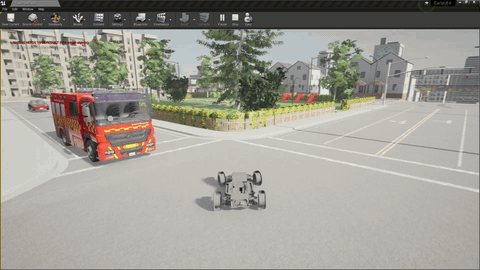

# Safe Occlusion-Aware Autonomous Driving

<!-- Replace the filename below with your actual GIF once converted -->
<div align="center">
  
</div>

**Autonomous emergency evasion at blind intersections — from formal safety theory to hardware deployment.**

B.Tech Project, Department of Mechanical Engineering, IIT Madras  
Student: Aadityanshu Abhinav (ME22B088) · Guide: Dr. Anuj Kumar Tiwari

---

## Overview

Blind intersections — where cross-traffic is hidden by a building corner, a parked truck, or a road curve — are among the most dangerous situations in autonomous driving. A purely reactive planner may receive too little warning to stop; a worst-case planner that always assumes a hidden threat is impractically conservative.

This project implements and deploys the game-theoretic occlusion-aware framework of [Zhang & Fisac (2021)](https://arxiv.org/abs/2105.08169) end-to-end:

1. **CARLA simulation** — hidden-set tracker, FSM planner, and all five FSM states validated in CARLA 0.9.16 (Town03).
2. **Hardware port** — full planner stack running on a PIX Moving Hooke autonomous chassis with an Ouster OS1-32 3D LiDAR, a YDLidar X2 2D near-field guard, and a Jetson Orin Nano.
3. **Outdoor experiments** — 12 contested runs at 3 km/h with a Yujin Robots Kobuki as the pursuer, all four evasion outcomes demonstrated, zero contacts.

---

## Evasion outcomes (hardware, 12 runs)

| Outcome | Runs | Proportion |
|---|---|---|
| PUSH (sprint through) | 3 | 25 % |
| BRAKE / EVADING | 6 | 50 % |
| Lateral Dodge | 2 | 17 % |
| Reverse | 1 | 8 % |
| **Contacts** | **0** | — |

---

## Repository structure

```
.
├── scenario_v3.py             # CARLA simulation planner
├── scenario_v3_hardware.py    # Hardware planner (Scenario Planner process)
├── can_publisher.py           # CAN Writer process — sole CAN bus writer
├── ydlidar_forwarder.py       # YDLidar Forwarder process — UDP broadcaster
├── pose_disp.py               # CARLA top-view visualiser
├── odometry_eval.py           # Odometry closure evaluation
├── calib.py                   # Steering encoder calibration
├── mapper.py                  # Occupancy map builder
├── ouster_diag.py             # Ouster OS1-32 diagnostics
├── ydlidar_diag.py            # YDLidar X2 diagnostics
├── sl10.py                    # Straight-line odometry test
├── test_02_steering_sweep.py  # Steering sweep test
├── test_04_odometry_square.py # Square-path odometry closure test
├── wp_logger.py               # GPS/odometry waypoint logger
├── wp_logger_odo.py           # Odometry-only waypoint logger
├── wp_follower.py             # Pure-pursuit waypoint follower
└── requirements.txt
```

---

## Hardware platform

| Component | Spec |
|---|---|
| Chassis | PIX Moving Hooke (2.6 m × 1.7 m), CAN at 500 kbit/s |
| 3D LiDAR | Ouster OS1-32, 32-beam, 10 Hz, 360° H × ±22.5° V, 1.3 m mount height |
| 2D LiDAR | YDLidar X2, front-mounted facing rearward, 8 m range |
| Compute | Jetson Orin Nano 8 GB, Ubuntu 22.04, Python 3.10 |
| Occluder | Tata Altroz (parked) |
| Pursuer | Yujin Robots Kobuki mobile robot |

---

## Software architecture

Three concurrent Python processes communicate over UDP; only one writes to the CAN bus.

```
Ouster OS1-32 ──(Ethernet)──┐
                             ▼
YDLidar X2 ──(USB)──► YDLidar Forwarder ──(UDP :5005)──►  Scenario Planner ──(UDP :5007)──► CAN Writer ──► PIX Hooke
                                                            │ hidden-set tracker              sole CAN writer
                                                            │ FSM + motion planner
                                                            │ 4 LiDAR safety guards
                                                            │   Ouster front / side
                                                            └─  YDLidar front / side
```

The Ouster is read inside the Scenario Planner via a daemon thread — there is no separate LiDAR driver process. Guards override the FSM command by strict priority: **estop > brake > drive**.

---

## Installation

### CARLA simulation

```bash
# Requires CARLA 0.9.16 — install the Python egg/wheel from your build:
export PYTHONPATH=$PYTHONPATH:~/carla/PythonAPI/carla/dist/carla-0.9.16-cp38-cp38-linux_x86_64.egg

pip install numpy shapely
python scenario_v3.py
```

### Hardware (Jetson Orin Nano)

```bash
pip install -r requirements.txt
# ydlidar SDK must be installed separately:
# https://github.com/YDLIDAR/YDLidar-SDK

# Terminal 1 — YDLidar Forwarder
python ydlidar_forwarder.py

# Terminal 2 — Scenario Planner (reads Ouster + YDLidar, runs FSM + guards)
python scenario_v3_hardware.py

# Terminal 3 — CAN Writer (sole CAN bus writer)
python can_publisher.py
```

The Ouster IP defaults to `192.168.1.1`; adjust `OUSTER_IP` in `scenario_v3_hardware.py` if needed.

---

## Safety notes

- A human operator held the RC kill-switch throughout every outdoor run.
- Operating speed was capped at 0.833 m/s (3 km/h).
- All outdoor runs were conducted at night on deserted roads.

---

## Citation

If you use this code, please cite the baseline paper this work extends:

```bibtex
@article{zhang2021occlusion,
  title   = {Safe Occlusion-aware Autonomous Driving via Game-Theoretic Active Perception},
  author  = {Zhang, Zixu and Fisac, Jaime F.},
  journal = {arXiv:2105.08169},
  year    = {2021}
}
```

---

## License

MIT
